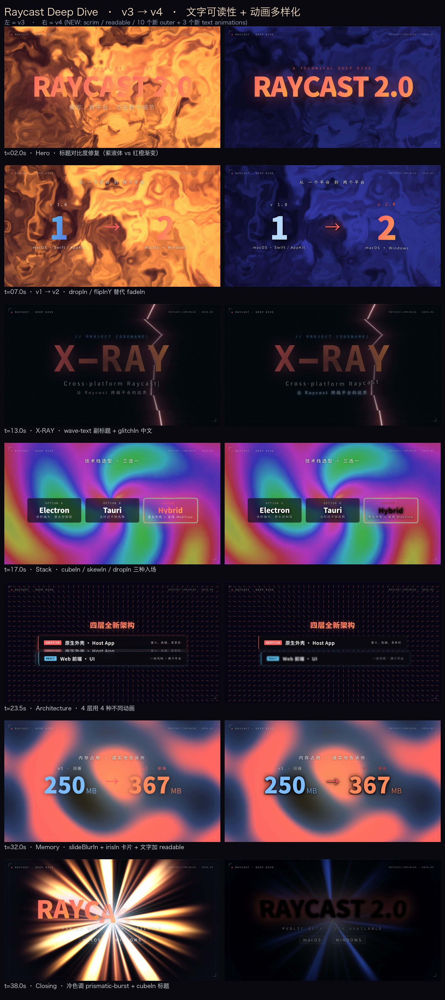
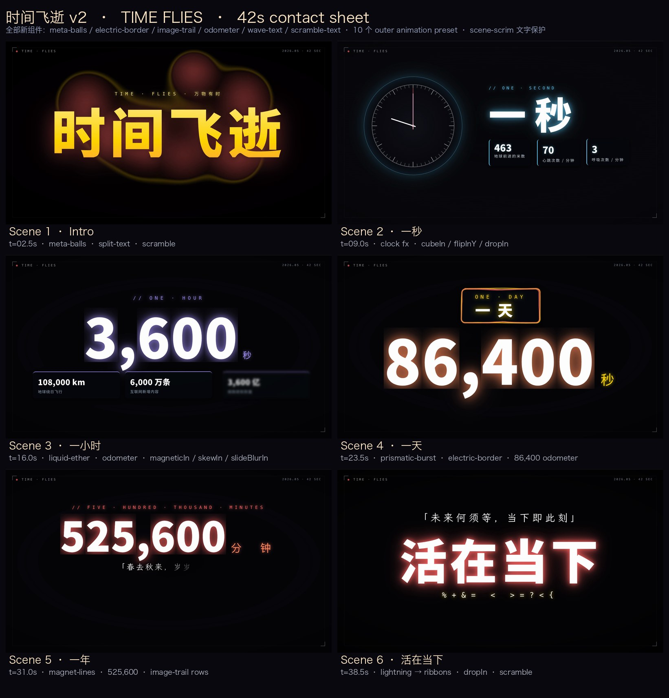

# motion-video-maker

> Build polished, fluid, cinematic animated videos as a single standalone
> HTML file — and render them deterministically to MP4.
>
> Distilled from [`react-bits`](https://reactbits.dev) (animation library),
> [`Remotion`](https://www.remotion.dev) (deterministic video rendering),
> and [`Hyperframes`](https://hyperframes.com) (HTML-native composition).

This repository is a **Cursor / Codex / Claude Code Skill**. Drop the
folder into your `~/.cursor/skills/` (or `~/.claude/skills/`) and any
agent will know how to author a composition, render it to MP4, and ship
a finished short video.



---

## What you get

- **17 text-animation components**: split / blur / shiny / gradient / glitch / decrypted / typewriter / rotating / count-up (with mechanical-odometer flip) / shuffle / mask / wave / scramble
- **11 Canvas backgrounds**: particles, starfield, aurora, threads, letter-glitch, waves, hyperspeed, dot-grid, noise, magnet-lines, ribbons
- **7 WebGL fragment-shader backgrounds**: liquid-ether, iridescence, prismatic-burst, lightning, plasma, beams, meta-balls
- **24 outer-animation presets** across 6 visual groups (fade / scale / mask reveal / 3D flip / physics / glitch). Highlights: `unmaskUp/Down/Left/Right`, `flipInX/Y`, `cubeIn`, `magneticIn`, `glitchIn`, `skewIn`, `kenBurnsIn`, `slideBlurIn`, `dropIn`, `irisIn`
- **3 element-level effects**: `electric-border`, `star-border`, `image-trail`
- **8 scene-to-scene transitions**: wipe / iris / pixel-dissolve / shape-morph / flash / glitch
- **Spring physics easing**: 7 presets from `springGentle` to `springStiff`
- **Text-readability stack** for shader-heavy backgrounds: `.scene-scrim`, `.text-plate`, `.text-card`, `data-scrim` runtime backdrop, `.text-readable`, `.text-stroke-dark`
- **Layout stability**: hidden clips keep their layout slot (`data-hide-mode` defaults to `visibility`) — already-visible siblings never jump when a later element fades in
- **12 open-source Chinese fonts**: Noto Sans SC, Noto Serif SC (思源宋体), LXGW WenKai (霞鹜文楷), ZCOOL series, Ma Shan Zheng, Long Cang, Liu Jian Mao Cao — with elegant typography helpers `.cn-serif` / `.cn-wenkai` / `.cn-sans` / `.cn-poster` / `.cn-brush` / `.cn-running`
- **Puppeteer-driven, frame-accurate MP4 renderer** with FFmpeg encoding

---

## Quick start (for humans)

```bash
git clone https://github.com/GordenSun/react-bits-video.git
cd react-bits-video
npm install                          # ~30s – installs puppeteer
node scripts/install-fonts.mjs       # ~30s – downloads 12 Chinese fonts

# scaffold a new video
node scripts/new-video.mjs my-video --duration 12 --fps 30 --bg aurora

# preview live in a browser
node scripts/preview.mjs examples/my-video/index.html
#  → http://localhost:5173/examples/my-video/index.html

# render to MP4 (deterministic, frame-accurate)
node scripts/render.mjs examples/my-video/index.html examples/my-video/output.mp4 \
     fps=30 crf=18 preset=medium
```

`ffmpeg` must be in `$PATH` (any modern build with `libx264` works).

---

## Quick start (for AI agents)

```bash
# Install once into your skills directory
cd ~/.cursor/skills   # or ~/.claude/skills
git clone https://github.com/GordenSun/react-bits-video.git
cd react-bits-video
npm install && node scripts/install-fonts.mjs
```

Then, in any agent conversation, ask:

> "Use the motion-video-maker skill to make a 30-second video about ___"

The agent will read `SKILL.md`, scaffold an `index.html`, render it,
and hand you back the MP4.

The contract is dead-simple — **one HTML file per video**, driven by
`data-*` attributes the runtime understands:

```html
<div id="stage" data-width="1920" data-height="1080"
     data-fps="30" data-duration="10">

  <!-- Background (Canvas or WebGL shader) -->
  <div data-background="liquid-ether"
       data-colors="#06061a,#1a1240,#2a2070,#0a3055"></div>

  <!-- Scene wrapper with readability scrim + layout-stable hide -->
  <div class="scene-scrim"
       data-clip data-hide-mode="visibility"
       data-start="0" data-duration="10"
       style="position: absolute; inset: 0; z-index: 10;">

    <h1 class="title"                                <!-- elegant 思源宋体 by default -->
        data-clip data-start="0.3" data-duration="9.4"
        data-text-animation="split-text"
        data-stagger="0.08" data-easing="springBouncy">岁月静好</h1>

    <p class="cn-wenkai" style="font-size:60px;"
       data-clip data-start="1.5" data-duration="8"
       data-animation="unmaskUp" data-easing="easeInOutQuart">「春水初生，春林初盛」</p>
  </div>

</div>

<script src="runtime/spring.js"></script>
<script src="runtime/timeline.js"></script>
<script src="runtime/components.js"></script>
<script src="runtime/shaders.js"></script>
<script src="runtime/transitions.js"></script>
<script src="runtime/effects.js"></script>
```

That's the whole file. The runtime registers a seekable timeline,
`render.mjs` opens the page in headless Chromium, calls
`window.__mvm.seek(i / fps)` for every frame `i`, screenshots the
viewport, and pipes the PNG sequence into FFmpeg.

---

## Folder layout

```
react-bits-video/
├── SKILL.md            # full agent-facing spec (read this!)
├── runtime/            # the entire client-side runtime
│   ├── timeline.js     # seekable frame-accurate timeline
│   ├── components.js   # 17 text anims + 11 canvas bg
│   ├── spring.js       # damped-harmonic-oscillator easing
│   ├── shaders.js      # 7 WebGL fragment-shader backgrounds
│   ├── transitions.js  # 8 inter-scene canvas overlays
│   ├── effects.js      # electric-border / star-border / image-trail / scrim
│   └── styles.css      # elegant defaults + readability stack + 8 .cn-* classes
├── scripts/
│   ├── render.mjs            # the renderer (puppeteer + ffmpeg)
│   ├── preview.mjs           # local web server for live preview
│   ├── install-fonts.mjs     # one-shot font downloader
│   ├── new-video.mjs         # scaffold a new composition
│   ├── debug.mjs             # inspect DOM state at any timestamp
│   └── snap.mjs              # single-frame high-res screenshot
├── templates/
│   ├── base.html             # composition starter template
│   ├── effects-showcase.html # 6-cell sampler for signature effects
│   └── readable-showcase.html# 12-cell sampler for readability stack
├── examples/
│   ├── time-flies-v2/        # 42s reflective piece — full feature tour
│   │   ├── index.html
│   │   ├── output.mp4
│   │   └── contact-sheet.jpg
│   └── raycast-deep-dive-v4/ # 40s technical-article retelling
│       ├── index.html
│       ├── output.mp4
│       └── v3-vs-v4-comparison.jpg
├── reference/
│   ├── components.md   # per-component prop tables + gotchas
│   └── workflow.md     # step-by-step recipes (data video / ad bumper / hook)
└── assets/fonts/       # downloaded by install-fonts.mjs (gitignored)
    └── fonts.css       # auto-generated @font-face stylesheet
```

---

## Showcase reels

| Reel | Length | What's in it |
|---|---|---|
| **[time-flies-v2](examples/time-flies-v2/)** | 42 s | All-in tour: meta-balls / aurora / liquid-ether / prismatic-burst / magnet-lines / lightning / ribbons backgrounds; odometer chain (463 → 70 → 3,600 → 86,400 → 525,600); electric-border / image-trail / clock effects; 思源宋体 + 霞鹜文楷 typography |
| **[raycast-deep-dive-v4](examples/raycast-deep-dive-v4/)** | 40 s | Tech-article retelling — 7 scenes × different entrance animation, electric-border on Hybrid card, magnet-lines architecture, image-trail rows, odometer memory counters, scene-scrim everywhere |



---

## How a composition runs

```
┌──────────────┐                          ┌──────────────────┐
│  index.html  │ ─── puppeteer page ───▶ │ Headless Chromium │
└──────────────┘                          └─────────┬────────┘
                                                    │
                       window.__mvm.seek(i/fps)     │  every frame:
                       ◀───────────────────────────┘  screenshot viewport
                                                    │
                       PNG sequence  ───────────────┴──▶  FFmpeg  ──▶  output.mp4
```

Compositions are **fully deterministic** — `seek(t)` always renders the
same pixels for the same `t`. No reliance on wall-clock or `requestAnimationFrame`
during render. That's how a 40-second composition reliably produces 1200
identical frames at 30 fps.

---

## Authoring tips (the short list)

1. **Pick one font path:** stick to either elegant serif (`Noto Serif SC` /
   `LXGW WenKai` — the new default) or modern bold (add `.cn-sans` to flip)
   for a unified mood.
2. **Always wrap a scene in `.scene-scrim`** when the background is a
   shader/aurora/letter-glitch — without it, text disappears on bright
   spots.
3. **Use `data-hide-mode="visibility"` (now the default)** so already-
   visible elements don't jump when a new sibling animates in.
4. **Cycle entrance presets across siblings.** Five cards in a row should
   use five different animations from at least two of: mask / 3D / physics
   / blur / glitch.  See `examples/raycast-deep-dive-v4/index.html`.
5. **3D entrance + gradient text doesn't work** in Chromium (the gradient
   `-webkit-text-fill-color: transparent` is killed by 3D `transform`).
   Use solid color + `text-shadow` halo instead.
6. **Preview at 15 fps first** (`fps=15 preset=ultrafast crf=24`) for
   iteration, then re-render the final at 30 fps with `preset=medium crf=18`.

The full spec is in [`SKILL.md`](SKILL.md) (read by AI agents).

## Common pitfall — invisible text on light/dark backgrounds

The single most common agent mistake is forgetting that **`#stage`
defaults to white text on a dark backdrop**.  If you add an element
with a light background **but don't change its text color**, the
white default will make the text invisible against the white card.

### Use paired utility classes — never write a half-pair

| If your container has… | Use this | What it guarantees |
|---|---|---|
| Dark background | `.mvm-card-dark`  | Dark bg + **white** text |
| Light background | `.mvm-card-light` | Light bg + **dark** text |
| Just text color | `.mvm-light` / `.mvm-dark` | Locks text color |
| Whole-scene flip | `.mvm-bg-light` / `.mvm-bg-dark` | Inverts theme |
| Light theme override | `style="--mvm-bg: #f7f5ef; --mvm-text: #0a0a0f"` on `#stage` | Auto-inherits everywhere |

```html
<!-- ✅ Good -->
<div class="mvm-card-light"><h2>清晰可见</h2></div>

<!-- ❌ Bad — text inherits white, becomes invisible -->
<div style="background: white"><h2>看不见</h2></div>
```

### Automatic contrast warnings

`runtime/contrast-check.js` runs during preview and render. Any text
element under 2.2:1 WCAG luminance ratio against its effective
background produces a `console.warn`. `scripts/render.mjs` collects
these and prints a summary at the end of the export — so you'll know
**before you ship** if you have invisible text in any frame.

See `templates/contrast-test.html` for a 4-cell self-test that
exercises both failure and success cases.

---

## Lineage

| Borrowed from | What we took |
|---|---|
| **react-bits** | Component taxonomy + naming (`split-text`, `iridescence`, `electric-border`, `meta-balls`, `image-trail`, `odometer`, `magnet-lines`, `ribbons`, `prismatic-burst`, `lightning`, `plasma`, `liquid-ether`, …). We re-implemented every shader in plain GLSL — no `ogl` dependency. |
| **motion.dev / framer-motion** | The closed-form damped harmonic oscillator math behind `springGentle/Soft/Snap/Smooth/Bouncy/Wobbly/Stiff`. |
| **Hyperframes** | HTML-native composition; `data-*` attribute API; one `index.html` per video; Puppeteer-screenshot frame capture. |
| **Remotion** | Frame-accurate deterministic seek; PNG → FFmpeg pipeline; Chromium launch flags. |

---

## License

MIT. The runtime, scripts, examples and documentation are MIT-licensed.

The downloaded fonts are governed by their own licenses (all
OFL-compatible — Noto fonts: SIL OFL 1.1; LXGW WenKai: OFL; ZCOOL
series: OFL; Ma Shan Zheng / Long Cang / Liu Jian Mao Cao: OFL).
See [Google Fonts licensing](https://fonts.google.com/about) and
[`scripts/install-fonts.mjs`](scripts/install-fonts.mjs) for the
manifest with URLs.
